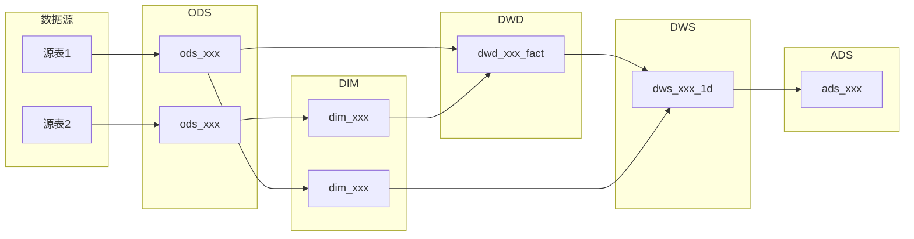

# {项目名称} 数据仓库设计文档

## 一、业务背景

{业务场景描述，包括业务类型、核心业务过程、数据消费方}

## 二、数据源清单

| 序号 | 来源系统 | 源表名 | 说明 | 数据量级(行/日) | 更新频率 |
|------|---------|--------|------|---------------|---------|
| 1 | | | | | |

## 三、分层架构

```
数据源 → ODS（贴源层）→ DIM（维度层） + DWD（明细层）→ DWS（汇总层）→ ADS（应用层）→ 应用端
```

### 各层表数量一览

| 层级 | 表数量 | 核心职责 |
|------|--------|---------|
| ODS  | {N}    | 原始数据入仓 |
| DIM  | {N}    | 公共维度管理 |
| DWD  | {N}    | 事实表清洗规范化 |
| DWS  | {N}    | 主题汇总 + 公共指标 |
| ADS  | {N}    | 业务报表 + 应用输出 |

### 数据流向图



## 四、ODS 层设计

### 表清单

| 表名 | 数据来源 | 加工方式 | 调度频率 | 分区策略 |
|------|---------|---------|---------|---------|
| | | | | |

### 表结构

#### {ods_表名}

```sql
CREATE TABLE {ods_表名} (
    -- 源表字段
    ...
    -- 元数据字段
    etl_time    TIMESTAMP   COMMENT 'ETL入库时间',
    data_source STRING      COMMENT '数据来源'
) COMMENT '{表注释}'
PARTITIONED BY (dt STRING COMMENT '数据日期')
STORED AS ORC;
```

**数据来源**：{来源系统}.{源表名}
**加工方式**：{全量快照 / 增量抽取}
**调度频率**：{每日 / 每小时 / 实时}

## 五、DIM 层设计

### 维度表清单

| 表名 | 维度实体 | SCD类型 | 上游表 | 加工方式 |
|------|---------|---------|--------|---------|
| | | | | |

### 表结构

#### {dim_表名}

```sql
CREATE TABLE {dim_表名} (
    ...
) COMMENT '{表注释}'
STORED AS ORC;
```

**上游表**：{ods_xxx}
**SCD 类型**：{Type 1 / Type 2 / 静态}
**加工方式**：{全量覆盖 / 拉链表合并}

## 六、DWD 层设计

### 事实表清单

| 表名 | 业务过程 | 粒度 | 上游表 | 加工方式 |
|------|---------|------|--------|---------|
| | | | | |

### 表结构

#### {dwd_表名}

```sql
CREATE TABLE {dwd_表名} (
    ...
) COMMENT '{表注释}'
PARTITIONED BY (dt STRING COMMENT '数据日期')
STORED AS ORC;
```

**上游表**：{ods_xxx, dim_xxx}
**清洗规则**：
1. {规则1}
2. {规则2}

## 七、DWS 层设计

### 表清单

| 表名 | 主题 | 粒度 | 统计周期 | 上游表 |
|------|------|------|---------|--------|
| | | | | |

### 指标定义

| 指标名 | 所在表 | 计算逻辑 | 聚合方式 |
|--------|--------|---------|---------|
| 日下单次数 | dws_trade_user_order_1d | COUNT(order_id) WHERE dt = '${bizdate}' | COUNT |
| 日下单金额 | dws_trade_user_order_1d | SUM(order_amount) WHERE dt = '${bizdate}' | SUM |
| 日支付转化率 | ads_daily_trade_report | pay_count_1d / order_count_1d（分子分母来自DWS） | 计算值 |
| | | | |

### 表结构

#### {dws_表名}

```sql
CREATE TABLE {dws_表名} (
    ...
) COMMENT '{表注释}'
PARTITIONED BY (dt STRING COMMENT '数据日期')
STORED AS ORC;
```

**上游表**：{dwd_xxx_fact, dim_xxx}
**加工逻辑**：
```sql
-- 核心SQL
SELECT ... FROM ... GROUP BY ...
```

## 八、ADS 层设计

### 表清单

| 表名 | 应用场景 | 消费方 | 上游表 | 输出方式 |
|------|---------|--------|--------|---------|
| | | | | |

### 表结构

#### {ads_表名}

```sql
CREATE TABLE {ads_表名} (
    ...
) COMMENT '{表注释}'
PARTITIONED BY (dt STRING COMMENT '数据日期')
STORED AS ORC;
```

**上游表**：{dws_xxx}
**加工逻辑**：{简述}
**输出方式**：{同步到MySQL / 推送Redis / 导出Excel}

## 九、数据质量规则 (DQC)

参见 `references/dqc-design.md`。每张事实表 / 维度表至少配 **1 条业务级规则**，否则视为设计未完成。

### 表级 DQC

| 表名 | 新鲜度 SLA | 行数下限 | 重复率上限 | 告警等级 |
|------|-----------|---------|-----------|---------|
| {dwd_xxx_fact} | T+1 03:00 前到达 | ≥ 昨日 90% | ≤ 0.01% | P1 |
| | | | | |

### 字段级 DQC

| 表名 | 字段 | 规则类型 | 约束 | 告警等级 |
|------|------|---------|------|---------|
| {dwd_xxx_fact} | order_id | UNIQUE NOT NULL | — | P0 |
| {dwd_xxx_fact} | order_amount | 值域 | ≥ 0 | P0 |
| {dwd_xxx_fact} | user_id | 外键 | exists in dim_user_info where is_current=1 | P0 |
| | | | | |

### 业务级 DQC（最关键，每张事实表至少 1 条）

| 规则名 | 涉及表 | 校验逻辑 | 告警等级 |
|--------|--------|---------|---------|
| 订单金额一致性 | dwd_trade_order_fact + dwd_trade_order_item_fact | order.amount ≈ SUM(item.qty × unit_price)（容差 0.01） | P0 |
| GMV 父子一致 | dws_trade_user_order_1d + ads_daily_gmv_report | SUM(order_amount_1d) = ads.gmv | P1 |
| 漏斗递减 | DWS 多表 | UV ≥ 加购UV ≥ 下单UV ≥ 支付UV | P1 |
| | | | |

## 十、设计自检（量化）

| # | 检查项 | 阈值 | 实际值 | 是否通过 |
|---|--------|------|--------|---------|
| 1 | DWS 复用度（DWS 表被 ADS 引用次数 / DWS 表数） | ≥ 1.5（≥ 2 优秀） | | |
| 2 | ADS / DWS 表数比 | ≤ 3 | | |
| 3 | DIM 表数 / 业务过程数 | 0.5–2（经验区间） | | |
| 4 | 单 DWS 表字段数（最大值） | ≤ 100 | | |
| 5 | 单 ADS SQL 关联表数（最大值） | ≤ 3 | | |
| 6 | 跨层引用合规率（无 ADS→ODS、无 DWS→ODS） | 100% | | |
| 7 | 时间分区覆盖率（排除拉链表 / 静态维度后） | 100% | | |
| 8 | 向上收敛（ODS→ADS 整体表数减少） | 通过 | | |
| 9 | 命名前缀合规率（ods_/dim_/dwd_/dws_/ads_） | 100% | | |
| 10 | DIM/DWD 边界（dim_ 仅 DIM 层、_fact 仅 DWD 层） | 100% | | |
| 11 | 比率指标存分子分母（DWS 中无比率字段） | 通过 | | |
| 12 | DQC 业务级规则覆盖率（每张事实表 ≥ 1 条） | 100% | | |
| 13 | 事实表类型已显式标注（事务 / 周期快照 / 累积快照） | 100% | | |
| 14 | SCD 类型已显式标注（每张维度表） | 100% | | |

> **小项目放宽**：PoC / 数据量小项目，第 1、3 项可适当放宽（DWS 复用度 ≥ 1 即可，DIM 与业务过程数比无下限）。其余硬指标不可放宽。
>
> 任一项未通过 → 返回第三步优化。
