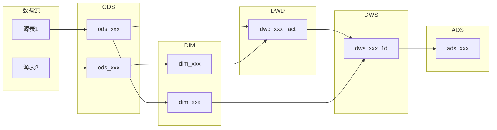

# {项目名称} 数据仓库设计文档

## 一、业务背景

{业务场景描述，包括业务类型、核心业务过程、数据消费方}

## 二、数据源清单

| 序号 | 来源系统 | 源表名 | 说明 | 数据量级(行/日) | 更新频率 |
|------|---------|--------|------|---------------|---------|
| 1 | | | | | |

## 三、分层架构

```
数据源 → ODS（贴源层）→ DIM（维度层） + DWD（明细层）→ DWS（汇总层）→ ADS（应用层）→ 应用端
```

### 各层表数量一览

| 层级 | 表数量 | 核心职责 |
|------|--------|---------|
| ODS  | {N}    | 原始数据入仓 |
| DIM  | {N}    | 公共维度管理 |
| DWD  | {N}    | 事实表清洗规范化 |
| DWS  | {N}    | 主题汇总 + 公共指标 |
| ADS  | {N}    | 业务报表 + 应用输出 |

### 数据流向图



## 四、ODS 层设计

### 表清单

| 表名 | 数据来源 | 加工方式 | 调度频率 | 分区策略 |
|------|---------|---------|---------|---------|
| | | | | |

### 表结构

#### {ods_表名}

```sql
CREATE TABLE {ods_表名} (
    -- 源表字段
    ...
    -- 元数据字段
    etl_time    TIMESTAMP   COMMENT 'ETL入库时间',
    data_source STRING      COMMENT '数据来源'
) COMMENT '{表注释}'
PARTITIONED BY (dt STRING COMMENT '数据日期')
STORED AS ORC;
```

**数据来源**：{来源系统}.{源表名}
**加工方式**：{全量快照 / 增量抽取}
**调度频率**：{每日 / 每小时 / 实时}

## 五、DIM 层设计

### 维度表清单

| 表名 | 维度实体 | SCD类型 | 上游表 | 加工方式 |
|------|---------|---------|--------|---------|
| | | | | |

### 表结构

#### {dim_表名}

```sql
CREATE TABLE {dim_表名} (
    ...
) COMMENT '{表注释}'
STORED AS ORC;
```

**上游表**：{ods_xxx}
**SCD 类型**：{Type 1 / Type 2 / 静态}
**加工方式**：{全量覆盖 / 拉链表合并}

## 六、DWD 层设计

### 事实表清单

| 表名 | 业务过程 | 粒度 | 上游表 | 加工方式 |
|------|---------|------|--------|---------|
| | | | | |

### 表结构

#### {dwd_表名}

```sql
CREATE TABLE {dwd_表名} (
    ...
) COMMENT '{表注释}'
PARTITIONED BY (dt STRING COMMENT '数据日期')
STORED AS ORC;
```

**上游表**：{ods_xxx, dim_xxx}
**清洗规则**：
1. {规则1}
2. {规则2}

## 七、DWS 层设计

### 表清单

| 表名 | 主题 | 粒度 | 统计周期 | 上游表 |
|------|------|------|---------|--------|
| | | | | |

### 指标定义

| 指标名 | 所在表 | 计算逻辑 | 聚合方式 |
|--------|--------|---------|---------|
| 日下单次数 | dws_trade_user_order_1d | COUNT(order_id) WHERE dt = '${bizdate}' | COUNT |
| 日下单金额 | dws_trade_user_order_1d | SUM(order_amount) WHERE dt = '${bizdate}' | SUM |
| 日支付转化率 | ads_daily_trade_report | pay_count_1d / order_count_1d（分子分母来自DWS） | 计算值 |
| | | | |

### 表结构

#### {dws_表名}

```sql
CREATE TABLE {dws_表名} (
    ...
) COMMENT '{表注释}'
PARTITIONED BY (dt STRING COMMENT '数据日期')
STORED AS ORC;
```

**上游表**：{dwd_xxx_fact, dim_xxx}
**加工逻辑**：
```sql
-- 核心SQL
SELECT ... FROM ... GROUP BY ...
```

## 八、ADS 层设计

### 表清单

| 表名 | 应用场景 | 消费方 | 上游表 | 输出方式 |
|------|---------|--------|--------|---------|
| | | | | |

### 表结构

#### {ads_表名}

```sql
CREATE TABLE {ads_表名} (
    ...
) COMMENT '{表注释}'
PARTITIONED BY (dt STRING COMMENT '数据日期')
STORED AS ORC;
```

**上游表**：{dws_xxx}
**加工逻辑**：{简述}
**输出方式**：{同步到MySQL / 推送Redis / 导出Excel}

## 九、设计自检

- [ ] **90% 原则**：绝大部分需求可通过 DWS/ADS 层查询满足
- [ ] **3 表原则**：单个需求 SQL 不超过 3 张表关联
- [ ] **ODS 完整性**：源数据全部入仓，未丢失字段
- [ ] **DIM 覆盖**：所有公共维度已建表，SCD 类型明确
- [ ] **DWD 质量**：清洗规则覆盖主要数据质量问题
- [ ] **DWS 复用性**：每张 DWS 表被 ≥2 张 ADS 表使用
- [ ] **ADS 对应性**：每张 ADS 表有明确的业务需求对应
- [ ] **命名一致性**：所有表名遵循命名规范
- [ ] **向上收敛**：DWS/ADS 表数量逐层减少
